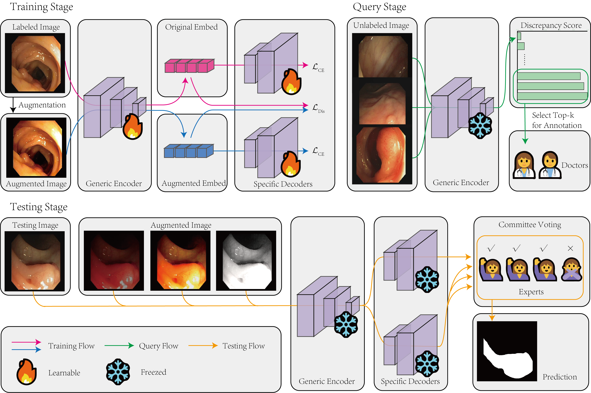

# DAAL-main

PyTorch implementation of "Enhancing Endoscopic Image Segmentation through Human-Machine Chromatic Discrepancy-Aware Active Learning".

  

## Setup
The following dependencies are recommended for the installation of the environment.

- python 3.8.13
- torch 1.11.0
- torchvision 0.12.0

## Dataset
It is recommended to download the CVC-ClinicDB dataset from the official website:

- CVC-ClinicDB: https://polyp.grand-challenge.org/CVCClinicDB/

, and place it in the "DAAL-main/data/" directory.

## Training and evaluation
For training and evaluation, use the following script:

- `python main.py`

, where config.py is the configuration file.
