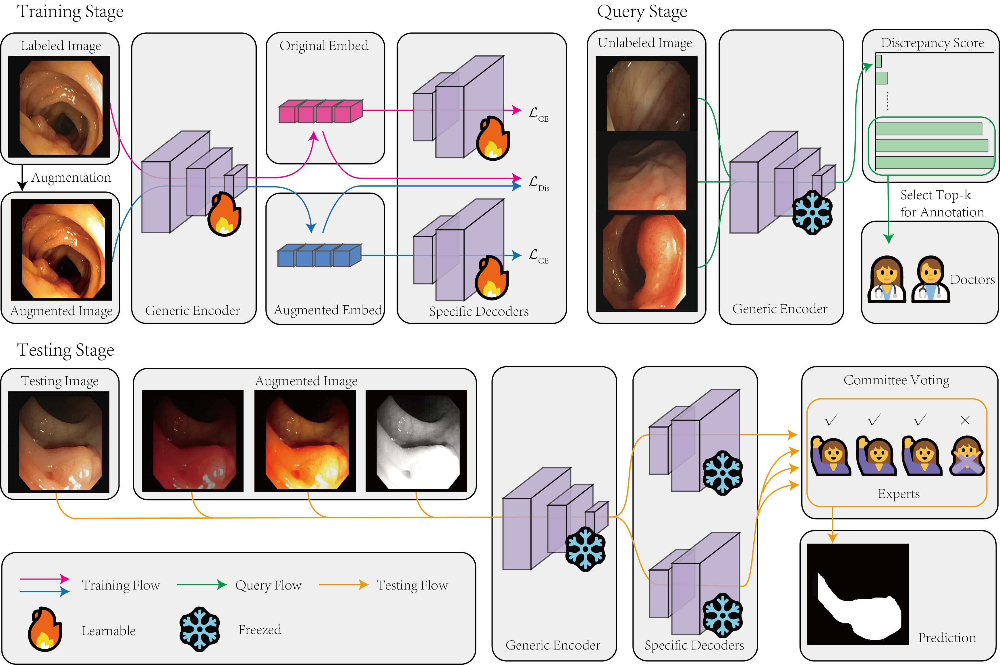

# DAAL-main

PyTorch implementation of "Enhancing Endoscopic Image Segmentation through Human-Machine Chromatic Discrepancy-Aware Active Learning".

<div align="center">
  
</div>

## Setup
The following dependencies are recommended for the installation of the environment.

- python 3.8.13
- torch 1.11.0
- torchvision 0.12.0

## Dataset
It is recommended to download the CVC-ClinicDB dataset from the official website:

- CVC-ClinicDB: https://polyp.grand-challenge.org/CVCClinicDB/

, and place it in the "DAAL-main/data/" directory.

## Training and evaluation
For training and evaluation, use the following script:

- `python main.py`

, where config.py is the configuration file.

## Citation
If you find our work useful in your research please consider citing our paper:
```
@article{han2026daal,
  title={DAAL: Discrepancy-Aware Active Learning for endoscopic image segmentation via human--machine chromatic discrepancy},
  author={Han, Tianyu and Xu, Zhimin and Wang, Yuerong and Xu, Huiyan and Hu, Haohao and He, Song and Zan, Peng and Bo, Xiaochen},
  journal={Biomedical Signal Processing and Control},
  volume={120},
  pages={110186},
  year={2026},
  publisher={Elsevier}
}
```
